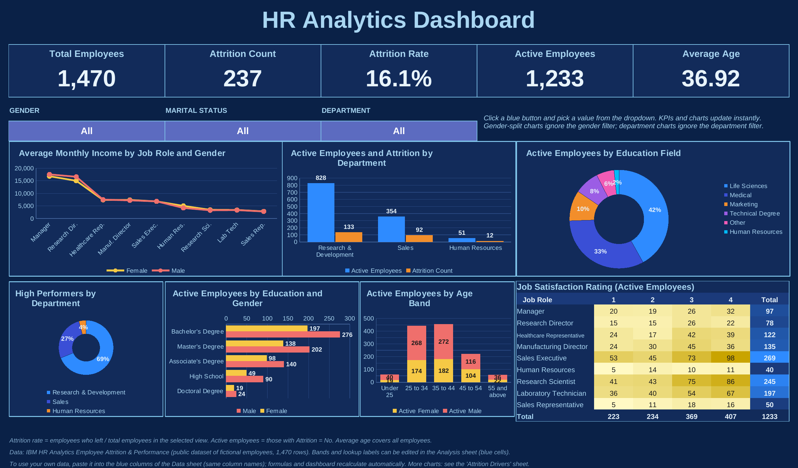
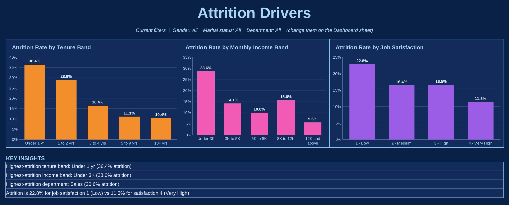

# HR Analytics Dashboard (Excel)

An interactive, dark-theme **HR Analytics dashboard built entirely in Excel** (formulas, dropdown filters, charts and conditional formatting). It analyses employee attrition, headcount, income, tenure, education and job satisfaction for 1,470 employees.

## Key metrics

| Metric | Value |
|---|---|
| Total employees | 1,470 |
| Attrition count | 237 |
| Attrition rate | 16.1% |
| Active employees | 1,233 |
| Average age | 36.92 |

## Key insights

- **Early-tenure risk:** employees with under 1 year at the company have the highest attrition (36.4%), compared with 10.4% for those with 10+ years.
- **Pay level:** the lowest monthly income band (under 3K) shows 28.6% attrition, versus 5.6% in the highest band.
- **Department:** Sales has the highest attrition (20.6%), followed by Human Resources (19.0%) and Research & Development (13.8%).
- **Job satisfaction:** attrition is 22.8% at satisfaction level 1 (Low) versus 11.3% at level 4 (Very High).

> These are patterns in the data, not proof of cause.

## Suggested actions

1. Strengthen onboarding and first-year check-ins to reduce early exits.
2. Review pay for the lowest income band.
3. Investigate the causes of attrition in Sales (exit interviews, manager feedback).
4. Track job satisfaction regularly and follow up on low scores.

## Features

- **KPI cards:** total employees, attrition count, attrition rate, active employees, average age.
- **Dropdown filters:** Gender, Marital Status and Department. KPIs and charts update instantly.
- **Charts:** income by job role and gender, active employees and attrition by department, education field, education by gender, age band by gender, high performers by department.
- **Job satisfaction heatmap:** job role by rating, using conditional formatting.
- **Attrition Drivers sheet:** attrition rate by tenure band, income band and job satisfaction, plus auto-generated insights (formula-driven text).
- **Fully formula-driven:** `COUNTIFS`, `AVERAGEIFS`, `INDEX/MATCH`, `IFERROR`. No macros, no hardcoded results.

## Workbook structure

| Sheet | Purpose |
|---|---|
| `Dashboard` | Main landscape dashboard with KPIs, filters and charts |
| `Attrition Drivers` | Attrition rate by tenure, income and satisfaction, with insights |
| `Analysis` | All calculation tables that feed the charts; band limits are editable (blue cells) |
| `Data` | Raw employee data (blue columns) and helper formula columns (age, income and tenure bands) |

## Definitions

- **Attrition rate** = employees who left / total employees in the selected view.
- **Active employees** = employees with Attrition = No.
- **Average age** covers all employees.
- Gender-split charts ignore the gender filter, and department charts ignore the department filter.

## Dataset

IBM HR Analytics Employee Attrition & Performance: a public dataset of **fictional** employees created by IBM data scientists.
Source: [IBM/employee-attrition-aif360](https://github.com/IBM/employee-attrition-aif360) (also available on Kaggle).

## How to use

1. Download `HR_Analytics_Dashboard.xlsx` and open it in Excel (desktop version recommended, 80% zoom).
2. Use the blue dropdown buttons on the `Dashboard` sheet to filter.
3. To use your own data, paste it into the blue columns of the `Data` sheet (keep the same column names).

## Skills demonstrated

Excel (advanced formulas, charts, conditional formatting, data validation), data cleaning, KPI design, dashboard design, data storytelling.

## Author

**Soham Kothare**
[LinkedIn](https://linkedin.com/in/soham-kothare) | [GitHub](https://github.com/sohamkothare024-coder)
